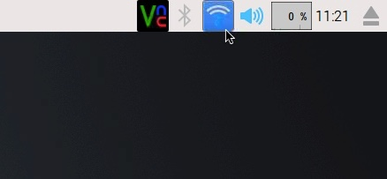
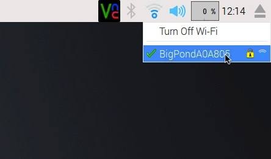
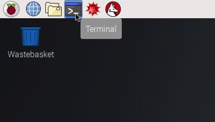
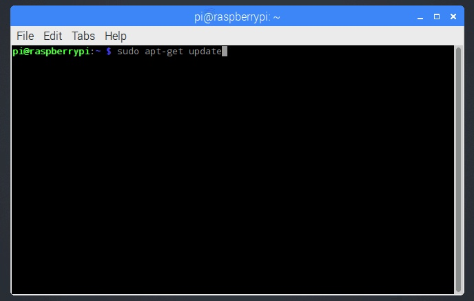
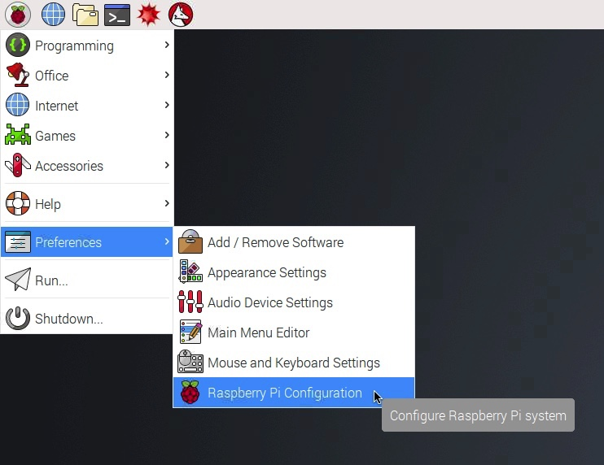
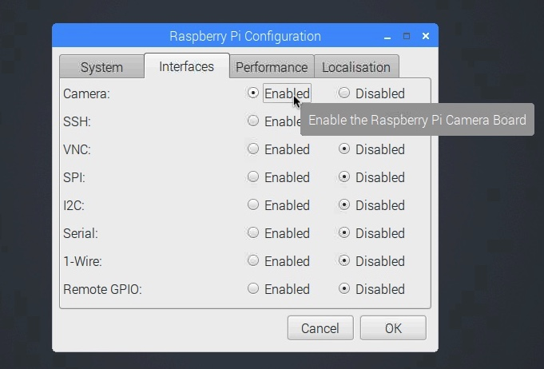
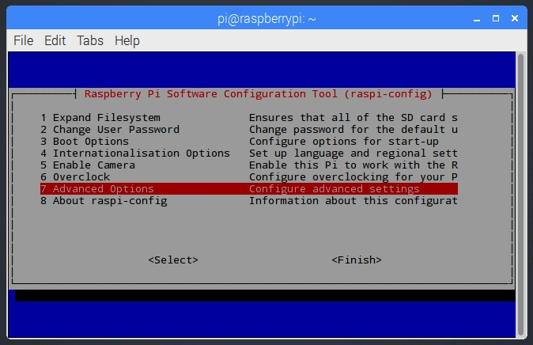
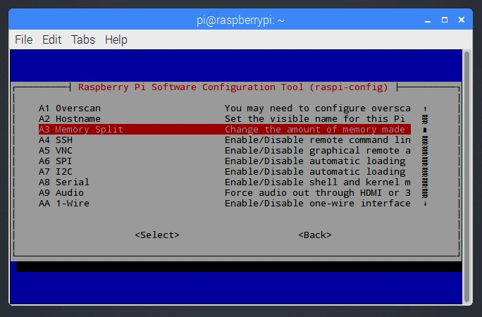
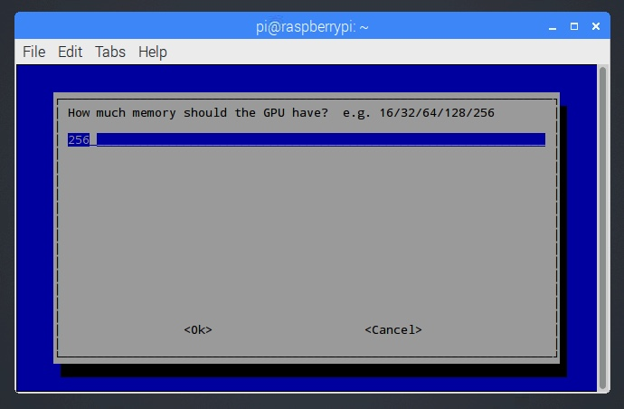

# Caviconsole Installation

## Instructions

These instructions assume you are using a new and unused Pi and a blank microSD card.

### Install the Raspberry Pi operating system on the microSD card

1. Follow the instructions at [http://raspberrypi.org/documentation/installation/noobs.md](https://www.raspberrypi.org/documentation/installation/noobs.md) to install NOOBS (New Out Of Box Software) on the microSD card. 

2. Insert the microSD card into the microSD card slot on the Pi.

3. Insert the USB keyboard and mouse into the USB ports on the Pi.

4. Insert the HDMI video cable into the HDMI port on the Pi and connect to a monitor/TV HDMI/DVI-D port (adapter may be required).

5. Insert the micro USB cable into the micro USB port on the Pi and into the computer micro USB port or wall socket USB power supply.

6. Once the Pi has loaded and showing a NOOBS installation screen choose the Raspbian operating system and follow steps to complete installation.

    


Alternatively you can 'flash' the operating system to a microSD card by using a program like Etcher or Windows equivalent.

### Pi setup

1. Connect the Pi to the internet.

    Connecting the Pi v3 to the internet is much easier than previous models. You can connect the Pi to an internet-accessible network by plugging an ethernet cable into the ethernet port on the Pi and then directly into a network router. The model 3 Raspberry Pi has Wi-Fi (enabled by default) and can be connected to any wireless network that broadcasts an SSID. At the top right of the desktop click the Wi-Fi icon on the task bar and you will see a list of available wireless networks. Click a network to join, providing a network key if required.

    
    

    **Problems connecting to a wireless network?**

    You may find that the Pi won't connect to the wireless or wired network of your organsation e.g. university. This is likely because of security.

    Most high-end smartphones have wireless hotspot capability. This allows nearby devices to use their internet connection over a temporary wireless 'hotspot' network. Usually the Pi has no problems connecting to these hotspots and may be a quick fix to get the Pi setup and running. Hotspots will be visible in the wireless network list.

2. Upgrade to the latest version of the operating system and install any updates.

    Open the terminal and enter the commands one line at time pressing return after each line and waiting for the command to finish before moving to the next. Answer Yes to any questions.

    ```
    sudo apt-get update
    sudo apt-get upgrade
    ```

    
    


3. Enable the Camera

    From the start menu (raspberry icon top left of the screen) select Preferences then Raspberry Pi Configuration. Click the interfaces tab and click 'Enabled' next to Camera to enable the camera. Restart the Pi.

    
    
    

4. Increase the GPU (Graphics Processing Unit) memory.

    In the terminal enter the following command:

    ```
    sudo raspi-config
    ```

    Using the cursor keys move down to "Advanced Options", press enter then move down to "Memory Split", press enter again and change the value to 256. Press down to go to Ok and press enter. On the main menu press right to get to the Finish option and press enter to exit. Restart the Pi.

    
    
    


### Install dependencies

Commands are entered into the terminal line by line followed by a carriage return (enter). Answer 'Y' to any questions.

1. Install/upgrade node and install npm

    ```
    sudo apt-get update
    sudo apt-get install nodejs npm -y
    ```

2. Install python libraries

    ```
    sudo apt-get update
    sudo apt-get install python-opencv -y
    ```

3. Install streamer dependencies

    ```
    sudo apt-get install libjpeg8-dev imagemagick libv4l-dev -y
    ```

4. Install networking and permissions dependencies

    ```
    sudo apt-get update
    sudo apt-get install hostapd isc-dhcp-server -y
    sudo apt-get install iptables-persistent -y
    sudo apt-get install acl -y
    ```

### Install programs and scripts

Commands are entered into the terminal line by line followed by a carriage return. Answer 'Y' to any questions.

1. Download cavicapture and caviconsole

    ```
    cd ~/
    git clone https://github.com/OpenSourceOV/cavicapture.git
    git clone https://github.com/OpenSourceOV/caviconsole.git
    cd cavicapture && git checkout 2.0
    ```

2. Install the node packages for caviconsole (may take some time and might generate a bunch of ‘warning’ error messages - these can be ignored)

    ```
    cd ~/caviconsole
    npm install
    ```

3. Set caviconsole permissions

    ```
    chmod +x ~/caviconsole/run.sh
    ```
  
4. Install mjpg streamer

    ```
    cd ~/
    sudo ln -s /usr/include/linux/videodev2.h /usr/include/linux/videodev.h
    wget http://www.opensourceov.org/app/uploads/2018/08/mjpg-streamer-code-r182.zip
    unzip mjpg-streamer-code-r182.zip
    cd mjpg-streamer-code-r182/mjpg-streamer
    make mjpg_streamer input_file.so output_http.so input_uvc.so
    mv ~/mjpg-streamer-code-r182/mjpg-streamer ~/
    ```

5. Setup networking

    ```
    sudo apt-get install hostapd isc-dhcp-server iptables-persistent -y
    ```

    Answer 'Yes' if it asks to save IPv4 or IPv6 rules.
    Don't worry if you see an error about failing to start a service.

    Assign a static IP to the wireless adapter
    
    ```
    sudo ifconfig wlan0 192.168.42.1
    ```

    Set hostapd config

    ```
    sudo apt-get install vim -y
    sudo vim /etc/init.d/hostapd
    ```

    Use the down cursor key to get to a line that starts ‘DAEMON_CONF’ and press ‘i’ and move the cursor to after the ‘=’ and add ‘/etc/hostapd/hostapd.conf’. It should look like this:

    ```
    DAEMON_CONF=/etc/hostapd/hostapd.conf
    ```
    
    Press ESC then :wq and press ENTER

6. Reboot

    Type 'reboot' in the console or go to the Raspberry icon top right and click 'Shutdown' and then select 'Reboot'.
        

## Running Caviconsole


1. Start caviconsole

    In the terminal run the command:

    ```
    ~/caviconsole/run.sh
    ```

2. Open the web browser on the Pi and enter address: http://localhost:6060 and give it a few seconds to load the app.