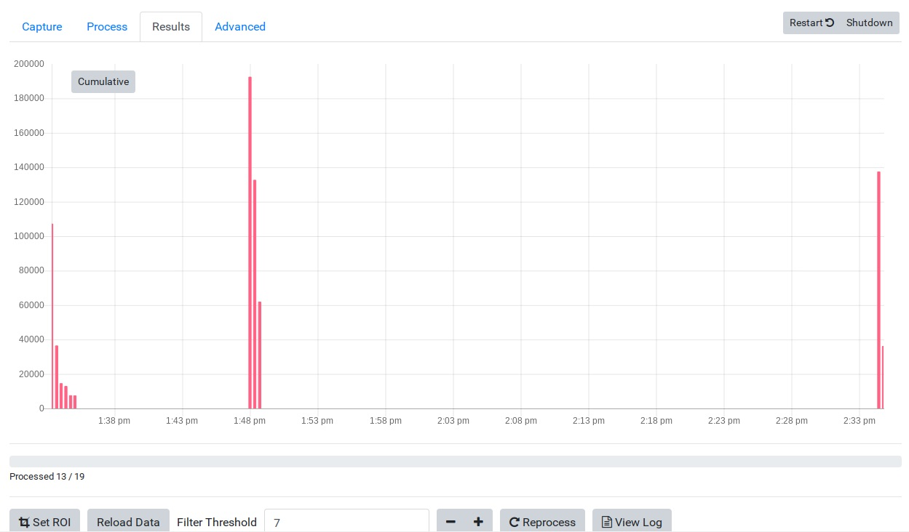

# Caviconsole

Caviconsole is a GUI (graphical user interface) for controlling image capture and processing using the OpenSourceOV clamp or 'cavicam' [OpenSourceOV/clamp-build-instructions](https://github.com/OpenSourceOV/clamp-build-instructions.git)

* [Installation](#installation)
* [Overview and usage](#overview-and-usage)
* [Additional configuration](#additional-configuration)
* [Issues or questions](#issues-or-questions)

## Installation

### Prerequisites

* Follow the instructions at [OpenSourceOV/raspberry-pi-setup](https://github.com/OpenSourceOV/raspberry-pi-setup.git) to install and setup the Raspberry Pi.
* **Ensure that you are running at least v4.4 ('Stretch') of the Raspbian operating system**. These instructions will not work with versions < 4.4 which have an earlier version of node that must be updated.
* Follow the instructions at [OpenSourceOV/cavicapture](https://github.com/OpenSourceOV/cavicapture.git) to install Cavicapture v2.
* Raspberry Pi is connected to the internet.


### Install dependencies

Commands are entered into the terminal line by line followed by a carriage return (enter). Answer 'Y' to any questions.

1. Install/upgrade node and install npm

    ```
    sudo apt-get update
    sudo apt-get install nodejs npm -y
    ```

2. Install streamer dependencies

    ```
    sudo apt-get install libjpeg8-dev imagemagick libv4l-dev -y
    ```

3. Install networking and permissions dependencies

    ```
    sudo apt-get update
    sudo apt-get install hostapd isc-dhcp-server -y
    sudo apt-get install iptables-persistent -y
    sudo apt-get install acl -y
    ```

4. Install text editor. Skip this step if you are familiar with vi or another text editor. 

  ```
  sudo apt-get install vim
  ```

### Install programs and scripts and setup networking

Commands are entered into the terminal line by line followed by a carriage return. Answer 'Y' to any questions.

1. Download caviconsole

    ```
    cd ~/
    git clone https://github.com/OpenSourceOV/caviconsole.git
    ```

2. Install the node packages for caviconsole. This may take some time and might generate a bunch of ‘warning’ error messages - these can be ignored.

    ```
    cd ~/caviconsole
    npm i
    ```

3. Set caviconsole permissions

    ```
    chmod +x ~/caviconsole/run.sh
    ```
  
4. Install mjpg streamer

    ```
    cd ~/
    sudo ln -s /usr/include/linux/videodev2.h /usr/include/linux/videodev.h
    wget http://www.opensourceov.org/app/uploads/2018/08/mjpg-streamer-code-r182.zip
    unzip mjpg-streamer-code-r182.zip
    cd mjpg-streamer-code-r182/mjpg-streamer
    make mjpg_streamer input_file.so output_http.so input_uvc.so
    mv ~/mjpg-streamer-code-r182/mjpg-streamer ~/
    ```

5. Setup networking

    ```
    sudo apt-get install hostapd isc-dhcp-server iptables-persistent -y
    ```

    Answer 'Yes' if it asks to save IPv4 or IPv6 rules.
    Don't worry if you see an error about failing to start a service.

    Assign a static IP to the wireless adapter
    
    ```
    sudo ifconfig wlan0 192.168.42.1
    ```

    Set hostapd config

    ```
    sudo vim /etc/init.d/hostapd
    ```

    Use the down cursor key to get to a line that starts ‘DAEMON_CONF’ and press ‘i’ and move the cursor to after the ‘=’ and add ‘/etc/hostapd/hostapd.conf’. It should look like this:

    ```
    DAEMON_CONF=/etc/hostapd/hostapd.conf
    ```
    
    Press ESC then type ':wq' (without single quotes) and press ENTER

6. Reboot

    Type 'reboot' in the console or click the Raspberry icon top left and click 'Shutdown' and then select 'Reboot'.
        

## Overview and usage

### Overview

Caviconsole interfaces with the cavicapture v2 programs (cavicapture and caviprocess) which do all the work capturing and processing the images. Caviconsole provides a web-based user interface for streaming a live feed from the camera, editing the cavicapture configuration file using a form, stopping and starting the scripts and displaying the results. Cavicapture does not require the GUI, likewise you can just use Caviconsole to edit the configuration file and run the cavicapture and caviprocess scripts manually from the console.

**Use one or more configuration files?**

One advantage of having a separate configuration file is you can save multiple versions for different sequences, projects etc and load into caviconsole whichever version is relevant for the current sequence. In practice you may find it easier/simpler/less confusing to have just one configuration file that everyone edits. 

Start by copying the example configuration file in the caviconsole directory to somewhere else easily accessible, like the Desktop. Use the file manager (File icon on top task bar) and find the caviconsole directory (/home/pi/caviconsole), right-click the 'default-config.ini' file and click 'copy' then right-click the Desktop (or wherever) and click 'Paste'. Rename the file to something like 'sequence.config'. If you mess up this file you'll always have the original default-config.ini to use as a backup/reference.

Caviconsole has four sections/screens:

* **Configuration** 
  * Sets the configuration file to use

* **Capture**
  * Configures image capture settings
  * Time synchronisation
  * Live camera feed
  * Capture preview
  * View image capture logs

* **Process**
  * Configures image processing settings
  * View processing queue
  * View image processing logs

* **Results**
  * Displays the results of automated image processing

* **Advanced**
  * Sets the GPIO port connected to the lights
  * Sets the location of cavicapture and caviprocess scripts
  * Toggles the device between Access Point and Wireless mode (see below for more details)


### Usage

Caviconsole is a web-based interface that runs over web protocols. This means that caviconsole can be accessed from the web browser on the Pi itself or **from any computer (or device, such as an ipad) connected to the same network as the Raspberry Pi**. This provides great flexibility in controlling multiple clamps from a single computer and running the pies/clamps in 'headless' mode where the pies can be controlled without any peripherals.

Some things to consider:

* Unless the Raspberry Pi is connected to the internet **it will not keep the correct time** and you will need to set the time before each sequence is initiated.
* If you use caviconsole via device that has the correct time you can use the 'Sync' button in the Capture section to synchronise the time between the device accessing the console and raspberry Pi. Neither the device or the Pi need to be connected to the internet for time synchronisation to work (but the time on the device needs to be correct).
* By default caviconsole does not start automatically when the raspberry pi starts i.e. you need to issue the start up command at some point to run caviconsole. So, if you want to run the Pi in headless mode then you either need to setup caviconsole to start up automatically (see [Start caviconsole on start-up](#start-caviconsole-on-start-up) for instructions and limitations), or connect to the raspberry pi over the network using [SSH](https://www.raspberrypi.org/documentation/remote-access/ssh/) or [VNC](https://www.raspberrypi.org/documentation/remote-access/vnc/README.md) and issue the start up command from there. 
* Where a network or internet connection are unavailable, the Rasbperry Pi can be configured to run as a wireless 'access point'. This means the Pi itself becomes a wireless router that allows other devices in wireless range to connect to it. This provides one of the most flexible methods for accessing the Pies and remotely controlling the clamp. See [Using the Pi as a WiFi Access Point](#using-the-pi-as-a-wifi-access-point) for details.

#### Image capture

1. Start caviconsole

    In the terminal run the command:

    ```
    ~/caviconsole/run.sh
    ```

2. Access caviconsole from a web browser.

    If you are accessing caviconsole from the Raspberry Pi (via a monitor connected to the Pi) then open the web browser (browser icon on top bar) and enter address: http://localhost:6060 and give it a few seconds to load the app.

    If you want to access caviconsole from a web browser on a computer connected to the same network as the raspberry pi then you first need to find the IP address of the Pi.

    Open a new terminal window and type:

    ```
    ifconfig
    ```

    Look through the output until you find the 'wlan0' section. The IP address is listed next to the 'inet' text:
    
    

    In the browser use the address:

    ```
    http://[ip address]:6060 
    
    e.g.
    http://192.168.43.185:6060/
    ```

    ... and give caviconsole a few seconds to load. Caviconsole runs from most modern tablet devices and smartphones.

3. Enter the location of the configuration file.

    

4. Adjust the image capture settings - see [OpenSourceOV/cavicapture](https://github.com/OpenSourceOV/cavicapture.git) for a description of cavicapture settings

    

5. Load the sample into the clamp and use the 'Live' button to open the live camera feed popup. Once the popup is open click the 'Start Streaming' **ONCE** and wait for the live feed to start. Click the 'Light' button to turn the light on/off. Use the live feed to position the sample. Click 'Stop Streaming' when done and turn off the light.
    
    

6. The live feed doesn't apply any of the image capture settings. Click the 'Preview' button to capture an image using the capture settings so you can confirm the settings are correct. 

7. Click the 'Start' button to initiate the capture sequence.

8. Click the 'View log' button and check for errors while it captures the first couple of images.

    


#### Image processing

Automated image processing will not affect the captured images. In most cases these images will still need to be processed manually by following the [image processing instructions](https://github.com/OpenSourceOV/image-processing-instructions.git). For some samples automated image processing works extremely well and can effectively track in near-realtime embolism events as they occur. 

Image processing can be run concurrently with image capture or after image capture has completed. For real-time results image processing should be initiated as soon as image capture has begun. 

1. Click the 'Process' tab at the top.

2. Adjust the settings - see [OpenSourceOV/cavicapture](https://github.com/OpenSourceOV/cavicapture.git) for a description of caviprocess settings. Default settings are appropriate for most setups.

    

3. Click the 'Start' to start processing

4. Click the 'View log' to monitor the log for errors while the first files are processed. Processing only initiates once the first 2 images have been captured.
    
    


#### Results

Once image processing has been started the 'Results' section will appear. This section provides a plot of image differences. 

  

Each value in the plot represents the **count** (not sum) of pixels that are different between a sequential pair of captured images. As a count the magnitude of difference is not represented in the plot, just the presence of any differences i.e. a pixel difference of 2 (a very small difference) has the same weight as a pixel difference of 200 (a very large difference).

See [OpenSourceOV/cavicapture](https://github.com/OpenSourceOV/cavicapture.git) for more information about image processing.

1. As each image is processed the plot should update automatically. Any issues with how the plot displays, try refreshing the browser window. This will not stop/affect image capture or processing but will reload the UI, which may fix the issue.
  
2. Use the 'Cumulative' button to toggle between a cumulative count of pixel differences (more analogous to the classic vulnerability curve.) 

3. Click on any of the points to open the point preview window.

4. The point preview window shows the original image and the processed image captured at that point. Use the 'Processed' button to toggle between the original image and the processed result. 

    
    

5. Use the cursor keys, or swipe left and right on a touch-enabled device, on the image to move to the next and previous images in the sequence. Only 4 images are loaded (2 either side).

6. Use the 'Area' form at the bottom to update the pixel count for the current image. This is useful for setting the count to zero if you have an image that is clearly just noise or artefacts. Anything other than zero would be difficult to justify. Updating this value will automatically change the value in the graph. 

7. Change the filter threshold to remove noise. If noise remains in the image then decrease the filter threshold value. After each adjustment you'll need to reprocess all the images by clicking the 'Reprocess' button. The plot will update as each image is reprocessed. Use the 'View log' to monitor image re-processing for errors.

## Additional configuration

### Start caviconsole on start-up

Edit the rc.local file to auto-start caviconsole when the Raspberry Pi loads so you don't have to run the caviconsole script each time you want to access the console:

```
sudo vim /etc/rc.local
```

and on a line before the final 'exit' add:

```
modprobe bcm2835-v4l2
(sleep 20;node /home/pi/caviconsole/server.js&)&
```

### Using the Pi as a WiFi Access Point

From the Advanced section clicking the 'Access Point' button will automatically reconfigure the Pi to run as a wireless access point. This means that the Pi runs like a router that you can connect to. Before enabling the access point mode edit the 'wifi-config.json' file in the caviconsole directory and change the 'passphrase' value to a secure pass code and, optionally, the 'ssid'. The SSID is the name of the raspberry pi as it appears in the list of wirless devices.


Once the wifi-config.json file has been edited, enable Access Point mode by clicking the 'Access Point' button. Once configured the Pi should automatically reboot after a few seconds. If it doesn't, click the Access Point button a second time and it should reboot. 

After the pi has rebooted you should see the pi listed in the available WiFi networks on whatever device you want to use to connect to the pi. If you didn't change the SSID you should see 'cavicam-one' listed. Connect to the network. Once connected, the IP address to use to connect to caviconsole (or the pi via SSH or VNC) is 192.168.44.1 (also configurable in the wifi-config.json file) e.g. http://192.168.44.1:6060

To revert back to the WiFi mode, click the 'Network' button and enter the SSID and password for the wireless network you want to connect to. Unfortunatley once you've enabled Access Point mode once this is the only way to connect to a different network from this point on (to be resolved).

## Issues or questions

Any issues with the caviconsole, cavicapture or caviprocess create an issue in the relevant github repository. See [Creating an issue](https://help.github.com/articles/creating-an-issue/).

For questions regarding the technique please contact timothy.brodribb@utas.edu.au.
